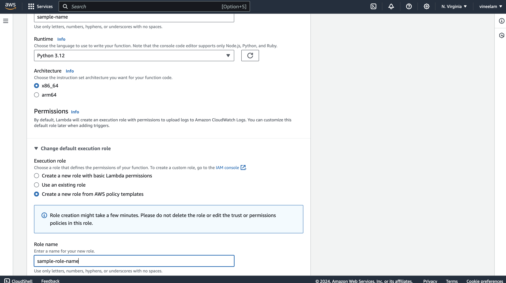

## Setup Installations:
Initially created a table in DynamoDb named <b>StudentRecords</b> with <b>student_id</b> as a primary key.   

  
Then lambda function named <b>"serverless-api-p"</b> is created   

  
I used python as a programming language to write the lambda function. 
 Role permisisions are also set to access the dynamoDb from lambda function and also gave permission access for CloudWatchLogsFullAccess.
   
 
  
 Then created API gateway and created resource and methods for those and deployed them. 
 
After deployment the url is:
<b> "https://shrvt75jte.execute-api.us-east-1.amazonaws.com/production/students?student_id=126" </b> 
  
below is the pic for created url's

  

### Testing the Urls's
Below are the pics for test images in postman for those url's
  
First posting the data to database
  

  
get students data using student_id
  

  

## Data in DynamoDb
Sample data in the table
  

  

delete student data with using student_id
  

  
check student data is present in database or not after deleting by using get method.
  

  

Items in dynamoDb are as follows:
  

  

## Challenges faced:
Need to check location and time while creating the table in DynamoDb, lambda Function and API gateway also need to configure permissions correctly for DynamoDbfull access and then checked ClodWatchlogs for 500 internal server errors and rectified them. 